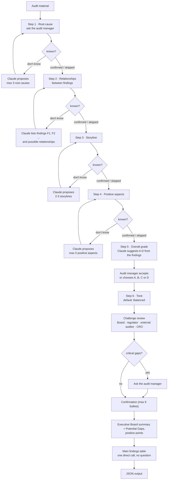

# Executive-Summary-Writer

A conversational agent that helps an audit manager write the Executive Board
summary of an audit report. It does not summarise straight away. It first guides
the audit manager through a short preparation phase (common root cause,
relationships between findings, storyline, tone), challenges the material from
the perspective of the Board, the regulator, the external auditor and the CRO,
and only then writes a three-paragraph summary in business UK English.

This is the Claude API + LangGraph implementation of an instruction originally
written for a chat assistant. The original instructions and the full skill texts
are kept local and are not published; only the skill descriptions are. In the
original chat-assistant version, the instruction asks the model to hold back the
summary. Here the graph enforces it: the node that writes the summary cannot be
reached until every preparation step has been confirmed or explicitly skipped.

This is the working-code home for the Hackathon 4 plan
`junhan-wen-executive-summary-writer.md`, submitted in
[SAAF-Project/SAAF-Project#132](https://github.com/SAAF-Project/SAAF-Project/pull/132).
What the agent must be judged against is in
[`AUDIT-CRITERIA.md`](AUDIT-CRITERIA.md).

## ESWriter web frontend

The `frontend/` folder contains the Next.js ESWriter app: upload a completed audit
PowerPoint, discuss its evidence with the Claude agent, edit the executive summary
and A–D grade in the presentation preview, and download the reviewed PowerPoint.
Previous audits are stored in the same browser and can be reopened for review.

```sh
cd frontend
npm ci
npm run demo
```

Open http://127.0.0.1:3000. The local launcher uses this repository's agent scripts;
connect Claude in the app or configure the service environment. For Vercel, use
`frontend` as the project's Root Directory. A reachable Python service is required
for hosted agent conversations; the frontend alone cannot reach a laptop's localhost.
See [frontend/README.md](frontend/README.md) for setup, deployment, limits and tests.

## Repository layout

```
skills/
  Skill description.md     One-paragraph description of each of the six executive analysis skills
scripts/
  run.py                   Entry point — terminal conversation with the audit manager
  graph.py                 LangGraph workflow: the steps, the interrupts and the gate before the summary
  llm.py                   Shared step logic, Claude API calls and run configuration (env vars)
  llm_openai.py            OpenAI / Azure OpenAI calls (Chat Completions), used when you choose OpenAI
  openai_config.py         Client and deployment settings for the OpenAI option
  llm_offline.py           Offline test: keyword rules and assumed AI output, no API calls
  prompts.py               System prompt and the task text for each step (generic wording)
  prompts_local.py         The organisation's own wording; replaces the generic texts when present
  material.py              Loads the audit material according to its input source type
  report_sections.py       Locates the sections of a report deck from its table of contents slide
  report_writer.py         Writes the summary onto the executive summary slide of the report deck
samples/
  synthetic-audit-report.md   Invented audit report for trying the agent
  Template - 0070 and 0010 - Audit report Anonymized.pptx   Audit report template, loaded by default
tests/
  test_graph.py            Conversation-flow tests with a scripted stand-in for the model (no API calls)
  test_llm_openai.py       OpenAI provider tests with a fake client (no API calls)
  test_llm_offline.py      Offline test provider run through the real graph (no API calls)
  test_material.py         Reading each input source type
  test_report_sections.py  Locating and loading the sections of a report deck
  test_report_writer.py    Writing the summary onto the deck
requirements.txt           Packages needed to run the agent (pip)
requirements-dev.txt       The same plus pytest, for running the tests
environment.yml            conda environment that installs requirements.txt
AUDIT-CRITERIA.md          Control objectives, acceptance criteria and known gaps (SAAF A2 standard)
```

## Workflow



1. **Ask first, propose second.** Each of the first four steps starts with a
   question. If the audit manager already knows the answer, it is used as given
   (a supplied storyline is refined and strengthened). Claude analyses the
   material and proposes a small number of options only when the audit manager
   does not know.
2. **One step per turn.** Every question is a LangGraph interrupt: the run stops
   and waits for a reply. After proposals, the agent waits for a selection, a
   refinement or an alternative before moving on. Rejected proposals are
   proposed again.
3. **The gate.** A request such as "Write an executive summary" or "Summarise in
   600 words" does not skip the preparation phase. Pass it with `--request`; its
   format preferences (length, number of paragraphs) are applied when the
   summary is finally written.
4. **Facts versus proposals.** Proposed relationships use cautious wording. Only
   what the audit manager confirmed is presented as fact in the summary; skipped
   items are worded as Internal Audit's view.
5. **Overall grade: propose first, then ask.** Here the order is reversed. The
   model reads all findings (title, risk, finding, root causes, risks, stakes,
   recommendation) and suggests a grade: "Based on the findings listed in the
   report, I would suggest the overall grade B: ...", with its reason. The audit
   manager presses Enter to accept or replies A, B, C or D. The grading table,
   the question and the reading of the reply are fixed texts and rules in
   `scripts/prompts.py` (`GRADES`, `GRADE_QUESTION`), not model calls, so the
   choice can become a drop-down menu in a user interface. The chosen grade and
   its definition go into the summary as the overall audit conclusion.

   | Grade | Definition |
   |---|---|
   | A | Risks identified in the audited process are well mitigated. Limited actions might be required. |
   | B | Risks identified in the audited process are adequately mitigated but actions are required on weaker aspects. |
   | C | Risks identified in the audited process are not sufficiently mitigated (one or more). Short-term actions are required. |
   | D | Risks identified in the audited process are not mitigated (one or more). Immediate actions are required. |

6. **Findings without questions.** The main findings and their recommendations
   are in the audit material already, so the audit manager is not asked for
   them. After the summary, one direct call sums up each finding and its
   recommendation in a sentence each (`SUMMARISE_FINDINGS` in
   `scripts/prompts.py`).
7. **Output.** The result is one JSON object, which is printed and saved as
   `output/executive-summary_<date>_<time>.json`:

   ```json
   {
     "exe_summary": "### Executive Board Summary\n\n...\n\n### Potential Gaps for Executive Board Consideration\n\n- ...",
     "pos_points": ["Payment is well controlled.", "Model is up-to-date."],
     "neg_points": {
       "Payment is not well controlled.": "The team should have a gateway.",
       "Model is not up-to-date.": "There should be a product owner."
     },
     "grade": "B"
   }
   ```

   `exe_summary` is the three-paragraph summary with the "Potential Gaps"
   section, as text. `pos_points` is a list of positive points. `neg_points`
   maps each main finding (four at most) to a one-sentence summary of its
   recommendation; where the material gives none, the model suggests one.
   `grade` is the overall grade the audit manager chose.

## Findings in a report deck

In a `.pptx` report, every slide with the title "Findings and recommendations"
holds one finding as a table: the first row is the title of the finding, and in
the rows below the first column is a fixed label and the second column its
content. These tables are sent to the model as plain text, with every request:

```
Finding title: 0123 – Access rights are not reviewed
Risk: High
Finding: Access rights were last reviewed in 2023. (AO02)
Root Cause(s): Nobody owns the review.
Risk(s): ...
Stake(s): ...
Recommendation: Appoint an owner and review each quarter.
```

The model uses these blocks for its proposals, for the summary and for the
"Main findings" table. Other slides are read as before.

## Output on the report deck

When the input is a `.pptx` report, the summary is also written onto the deck
itself. The section "Executive summary" is found through the table of contents
(slide 4 in the template), and the placeholder text in the block that starts
with "Audit conclusion" is replaced by the three summary paragraphs. The heading
and the formatting of the block are kept. Two more places on the same slide are
filled:

| JSON field | Place on the slide |
|---|---|
| `exe_summary` | Block "Audit conclusion" |
| `pos_points` | Block "Positive aspects", one bullet per point |
| `neg_points`, the findings | Table "Main findings", column "Main findings", one row per finding |
| `neg_points`, the recommendations | Same row, column "Recommendation", followed by `(suggested by AI\|<model name>)` |
| `grade` | Square in the "Findings" box at the top right, with the colour of the grade (`GRADE_COLOURS` in `scripts/report_writer.py`) |

The note after a recommendation is added by the code (`AI_NOTE` in
`scripts/report_writer.py`), not by the model, so it is always there. The column
"Finding owner" is left for the audit manager. The table of the template has
four rows; findings beyond that are not written and are named in a warning.

### Number of findings per risk level

These numbers are counted by the code, not by the model. On every slide with the
title "Findings and recommendations", the first row of the table states the
title of the finding and its risk as `Risk: High`, `Risk: Medium` or
`Risk: Low`. From these:

- the "Findings" box at the top right of the executive summary slide gets the
  number of findings under H, M and L;
- the table on the "Finding overview" slide gets one row per finding, with its
  title and a `1` in the column of its risk level, and the same numbers in the
  row "Total". Rows are added when there are more findings than rows, and rows
  that are not needed are emptied.

A finding whose risk is none of the three (for example `Risk: xxx` in the empty
template) is listed without a `1`, is not counted, and is named in a warning.

- The input file is not changed. The result is saved next to the JSON
  output, as `output/<original file name>_summary_filled.<original extension>`.
  A later run on the same deck replaces that file.
- Only the text under "Executive Board Summary" goes on the slide. The
  "Potential Gaps" section is for the audit manager and stays in the JSON
  file.
- The block has a fixed size (roughly 200 words at 10 pt). Longer text is set
  smaller, down to 7 pt; beyond that a warning is printed. Ask for a short
  summary with `--request` when the result is meant for the slide.

## Requirements

```bash
python -m venv .venv
source .venv/bin/activate        # Windows: .venv\Scripts\activate
pip install -r requirements.txt
```

With conda:

```bash
conda env create -f environment.yml
conda activate executive-summary-writer
```

`requirements.txt` holds the one list of packages; `environment.yml` installs
from it. Two packages have a different name when you install them than when you
import them: `python-docx` (imported as `docx`) and `python-pptx` (imported as
`pptx`). To add them to an existing conda environment:

```bash
conda install -c conda-forge python-docx python-pptx openpyxl
```

| Package | Needed for |
|---|---|
| `anthropic`, `langgraph`, `pydantic` | Every run, including the offline test |
| `python-docx` | `.docx` input |
| `python-pptx` | `.pptx` input and writing the summary onto the deck |
| `openpyxl` | `.xlsx` input |
| LibreOffice (not a Python package) | `.doc`, `.xls` and `.ppt` input |
| `openai`, plus what `scripts/openai_config.py` imports (`azure-identity`) | The OpenAI option only |

- Python 3.10+
- An Anthropic API key in your environment:
  ```bash
  export ANTHROPIC_API_KEY=sk-ant-...
  ```

**No credentials are hard-coded**: the API key is read from `ANTHROPIC_API_KEY`.

## Running

Run from the repository root:

```bash
python scripts/run.py
python scripts/run.py samples/synthetic-audit-report.md
python scripts/run.py report.docx management-responses.pdf --request "3 paragraphs / 600 words, factual tone"
```

### Input source type

The input source type says how the audit material is read:

| Type | Read as |
|---|---|
| `txt`, `md` | The text as it is |
| `docx` | Paragraphs, then tables |
| `xlsx` | Every sheet, one line per row (calculated values, not formulas) |
| `pptx` | Every slide: text boxes, tables and speaker notes |
| `doc`, `xls`, `ppt` | Converted with LibreOffice (`soffice` must be installed), then read as above |
| `pdf` | Sent to the model as a document (Claude only) |

- **No file given**: the type defaults to `pptx` and the sample
  `samples/Template - 0070 and 0010 - Audit report Anonymized.pptx` is loaded.
  `--input-source-type md` without a file loads the synthetic report instead.
- **File given, no type**: the type is taken from each file's extension.
- **File and type given**: the file is read as that type whatever its name. This
  is for an interface that uploads the file and passes the type along. In code,
  that is `load_material([path], source_type="pptx")` from `scripts/material.py`.

The agent first asks which API to use:

```
Which API do you want to use?
  1. OpenAI
  2. Claude
  3. Offline test (no API, assumed AI output)
```

Then answer each question in the terminal. Reply `skip` to skip a step, press
Enter at the tone question for the default, and type `quit` to stop without a
summary.

| Flag | Effect |
|---|---|
| `--api openai\|claude\|offline` | Choose the API on the command line and skip the question |
| `--input-source-type TYPE` | `txt`, `md`, `doc`, `docx`, `xls`, `xlsx`, `ppt`, `pptx` or `pdf`; see above |
| `--request TEXT` | Your original request; its format preferences are applied to the final summary |
| `--output-dir DIR` | Folder where the summary is saved (default `./output`) |
| `--verbose` | Also log token usage per model call, including prompt-cache reads |

## Configuration

`scripts/llm.py` reads everything from environment variables (defaults shown):

| Variable | Default | Purpose |
|---|---|---|
| `ANTHROPIC_API_KEY` | _(required)_ | API key, read by the SDK automatically |
| `ANTHROPIC_MODEL` | `claude-opus-5-5` | Model id |
| `MODEL_EFFORT` | `high` | Effort for the analysis and writing calls (`low`, `medium`, `high`, `xhigh`, `max`). Interpreting the audit manager's replies always uses `low` |
| `MAX_OUTPUT_TOKENS` | `16000` | Max tokens per reply |
| `MAX_RETRIES` | `4` | Retries per model call, done by the Anthropic SDK with exponential backoff |
| `REQUEST_TIMEOUT_SECONDS` | `600` | Request timeout |
| `USE_REFUSAL_FALLBACKS` | `1` | If a safety classifier declines a request, the API re-runs it on Anthropic's recommended fallback model. Set to `0` to switch this off |

The audit material is sent with a prompt-cache breakpoint, so the calls after
the first read the system prompt and the material from the cache while the
conversation is active.

## Choosing the API

- **Claude** (default setup): uses the Anthropic SDK and the environment
  variables in the table above.
- **OpenAI**: uses the Chat Completions API. Install the `openai` package and
  edit `scripts/openai_config.py` so that it defines `client` (an
  `openai.OpenAI` or `openai.AzureOpenAI` instance) and `DEPLOYMENT_NAME` (the
  model or deployment to call). `TEMPERATURE`, `TOPPVALUE` and
  `RESPONSE_MAX_TOKENS` are used if the file defines them. With OpenAI, PDF
  input is not supported, and the settings in the table above do not apply.

- **Offline test**: no API, no key and no network. See below.

All options run the same graph and the same steps.

## Offline testing

```bash
python scripts/run.py samples/synthetic-audit-report.md --api offline
```

Use this to develop and try the conversation without access to a model. The
interaction is the real one: the same graph asks the same questions (root cause,
relationships, storyline, positive aspects, overall grade, tone, challenge
review) and stops for your reply each time. Only the model is replaced, by `scripts/llm_offline.py`:

- **Your replies** are read with keyword rules. `no`, `don't know` or an empty
  reply asks for proposals; `skip` skips the step; `1`, `option B` or `1 and 3`
  selects from the proposals, and `all` takes every one; `other options` shows a
  second set; anything else is taken as your own answer.
- **AI output** is assumed: fixed proposals, a fixed suggested grade (C), two
  fixed challenge questions and a
  placeholder summary that repeats what you confirmed, the tone and your
  `--request`. Every such text starts with `[OFFLINE TEST: assumed AI output,
  not based on your material]`. The positive and negative points in the JSON
  are fixed too and start with `(Assumed.)`; they do not follow your answer to
  step 4 or the findings in your material.

The assumed texts are modelled on `samples/synthetic-audit-report.md` and do not
change with the material you load, so the offline test checks the flow, not the
quality of the analysis or the writing. Edit the `ASSUMED_...` constants in
`scripts/llm_offline.py` to try other outputs.

## Using your own wording

`scripts/prompts.py` contains generic texts. To use your organisation's own
wording, edit `scripts/prompts_local.py` and redefine any of the names from
`prompts.py` there, for example `SYSTEM_PROMPT` or `ROOT_CAUSE`. If you redefine
a step, also redefine `STEPS`.
The file is loaded automatically when present.

## Tests

```bash
pip install -r requirements-dev.txt
pytest tests/
```

The tests replace Claude with a scripted stand-in and check the conversation
flow: the first response only asks the Step 1 question, no summary is written
before all steps are done, proposals are followed by a stop, and skipped steps
and the default tone are handled.

## Known gaps / TODO

- Only the complete-instruction variant is implemented. The
  instruction-with-skills variant (six skills, with a separate theme-synthesis
  step) is not.
- Terminal conversation only; there is no web or chat front end.
- The conversation is kept in memory. A run that is stopped cannot be resumed
  later.
- Not yet evaluated on a set of reports with reference summaries.

## Ownership / data handling

Built by Junhan Wen and processed with Claude. Draft audit reports are
confidential: do not commit real audit evidence, personal data, or credentials.
`samples/` contains synthetic material only; `output/` and `data/` are
git-ignored.
