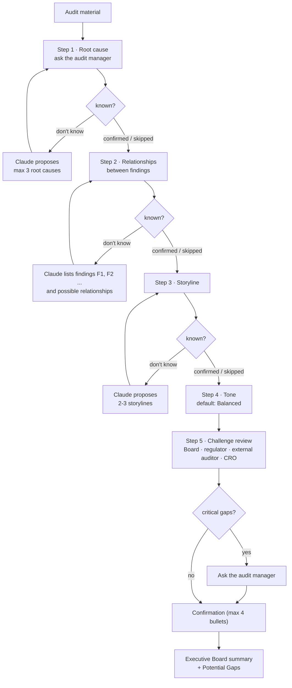

# Executive-Summary-Writer

A conversational agent that helps an audit manager write the Executive Board summary of an audit report. It does not summarise straight away. It first guides the audit manager through a short preparation phase (common root cause, relationships between findings, storyline, tone), challenges the material from the perspective of the Board, the regulator, the external auditor and the CRO, and only then writes a three-paragraph summary in business UK English.

This is the Claude API + LangGraph implementation of an instruction originally written for a chat assistant. The original instructions and the full skill texts are kept local and are not published; only the skill descriptions are. In the original chat-assistant version, the instruction asks the model to hold back the summary. Here the graph enforces it: the node that writes the summary cannot be reached until every preparation step has been confirmed or explicitly skipped.

## Repository layout

```
skills/
  Skill description.md     One-paragraph description of each of the six executive analysis skills
scripts/
  run.py                   Entry point — terminal conversation with the audit manager
  graph.py                 LangGraph workflow: the steps, the interrupts and the gate before the summary
  llm.py                   Claude API calls and run configuration (env vars)
  prompts.py               System prompt and the task text for each step (generic wording)
  material.py              Loads the audit material (.txt, .md, .docx, .pdf)
samples/
  synthetic-audit-report.md   Invented audit report for trying the agent
tests/
  test_graph.py            Conversation-flow tests with a scripted stand-in for Claude (no API calls)
```

## Workflow



1. **Ask first, propose second.** Each of the first three steps starts with a question. If the audit manager already knows the answer, it is used as given (a supplied storyline is refined and strengthened). Claude analyses the material and proposes a small number of options only when the audit manager does not know.
2. **One step per turn.** Every question is a LangGraph interrupt: the run stops and waits for a reply. After proposals, the agent waits for a selection, a refinement or an alternative before moving on. Rejected proposals are proposed again.
3. **The gate.** A request such as "Write an executive summary" or "Summarise in 600 words" does not skip the preparation phase. Pass it with `--request`; its format preferences (length, number of paragraphs) are applied when the summary is finally written.
4. **Facts versus proposals.** Proposed relationships use cautious wording. Only what the audit manager confirmed is presented as fact in the summary; skipped items are worded as Internal Audit's view.
5. **Output.** The confirmation bullets, the three-paragraph summary and a "Potential Gaps for Executive Board Consideration" section, printed and saved as Markdown.

## Requirements

```bash
python -m venv .venv
source .venv/bin/activate        # Windows: .venv\Scripts\activate
pip install -r requirements.txt
```

- Python 3.10+
- An Anthropic API key in your environment:
  ```bash
  export ANTHROPIC_API_KEY=sk-ant-...
  ```

**No credentials are hard-coded**: the API key is read from `ANTHROPIC_API_KEY`.

## Running

Run from the repository root:

```bash
python scripts/run.py samples/synthetic-audit-report.md
python scripts/run.py report.docx management-responses.pdf --request "3 paragraphs / 600 words, factual tone"
```

Answer each question in the terminal. Reply `skip` to skip a step, press Enter at the tone question for the default, and type `quit` to stop without a summary.

| Flag | Effect |
|---|---|
| `--request TEXT` | Your original request; its format preferences are applied to the final summary |
| `--output-dir DIR` | Folder where the summary is saved (default `./output`) |
| `--verbose` | Also log token usage per model call, including prompt-cache reads |

## Configuration

`scripts/llm.py` reads everything from environment variables (defaults shown):

| Variable | Default | Purpose |
|---|---|---|
| `ANTHROPIC_API_KEY` | _(required)_ | API key, read by the SDK automatically |
| `ANTHROPIC_MODEL` | `claude-opus-5-5` | Model id |
| `MODEL_EFFORT` | `high` | Effort for the analysis and writing calls (`low`, `medium`, `high`, `xhigh`, `max`). Interpreting the audit manager's replies always uses `low` |
| `MAX_OUTPUT_TOKENS` | `16000` | Max tokens per reply |
| `MAX_RETRIES` | `4` | Retries per model call, done by the Anthropic SDK with exponential backoff |
| `REQUEST_TIMEOUT_SECONDS` | `600` | Request timeout |
| `USE_REFUSAL_FALLBACKS` | `1` | If a safety classifier declines a request, the API re-runs it on Anthropic's recommended fallback model. Set to `0` to switch this off |

The audit material is sent with a prompt-cache breakpoint, so the calls after the first read the system prompt and the material from the cache while the conversation is active.

## Using your own wording

`scripts/prompts.py` contains generic texts. To use your organisation's own wording without publishing it, create `scripts/prompts_local.py` (git-ignored) and redefine any of the names from `prompts.py` there, for example `SYSTEM_PROMPT` or `ROOT_CAUSE`. If you redefine a step, also redefine `STEPS`. The file is loaded automatically when present.

## Tests

```bash
pip install -r requirements-dev.txt
pytest tests/
```

The tests replace Claude with a scripted stand-in and check the conversation flow: the first response only asks the Step 1 question, no summary is written before all steps are done, proposals are followed by a stop, and skipped steps and the default tone are handled.

## Known gaps / TODO

- Only the complete-instruction variant is implemented. The instruction-with-skills variant (six skills, with a separate theme-synthesis step) is not.
- Terminal conversation only; there is no web or chat front end.
- The conversation is kept in memory. A run that is stopped cannot be resumed later.
- Not yet evaluated on a set of reports with reference summaries.

## Ownership / data handling

Built by Junhan Wen and processed with Claude. Draft audit reports are confidential: do not commit real audit evidence, personal data, or credentials. `samples/` contains synthetic material only; `output/` and `data/` are git-ignored.
